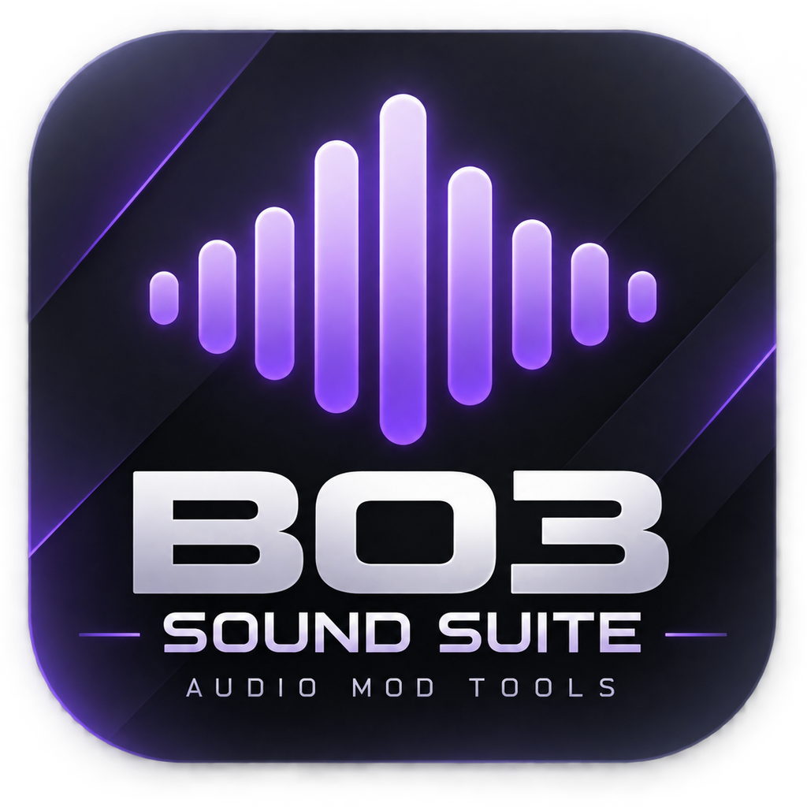

<div align="center">
  

[🇫🇷 Français](README.md) · [🇬🇧 English](README_EN.md) · [🇪🇸 Español](README_ES.md) · 🇩🇪 **Deutsch** · [🇮🇹 Italiano](README_IT.md)

# BO3 Sound Suite

### Sound für deine Black-Ops-III-Maps – von der Audiodatei bis zur SZC

Konvertiere Sounds in BO3-WAV, erstelle Sound-Alias-CSV-Dateien und füge die CSV deiner Map hinzu – mit einer einzigen Windows-Anwendung.

[](https://github.com/GaLeX-Le-Penguin/BO3-Sound-Suite/releases/latest)
[](https://github.com/GaLeX-Le-Penguin/BO3-Sound-Suite/releases/latest)


### [⬇️ BO3 Sound Suite herunterladen](https://github.com/GaLeX-Le-Penguin/BO3-Sound-Suite/releases/latest)

[Alle Versionen](https://github.com/GaLeX-Le-Penguin/BO3-Sound-Suite/releases) · [Problem melden](https://github.com/GaLeX-Le-Penguin/BO3-Sound-Suite/issues)
</div>

## Über das Projekt

BO3 Sound Suite vereint die drei Schritte der Audiovorbereitung für **Call of Duty: Black Ops III Mod Tools**. Die Benutzeroberfläche ist auf Französisch und Englisch verfügbar und öffnet sich im Audiokonverter.

```text
Audiodateien  →  BO3-WAV  →  Sound-Alias-CSV  →  SZC-Datei der Map
```

## Funktionen

### 🔊 Audiokonvertierung

- WAV-, MP3-, AIFF-, AIF- und WMA-Dateien auswählen oder per Drag-and-drop hinzufügen.
- Konvertierung in BO3-WAV mit **48 kHz / 16-Bit-PCM**.
- Konvertierte Dateien werden standardmäßig **im selben Ordner wie die Originaldatei** gespeichert, auch außerhalb von `sound_assets`.
- Ausgabepfad für jede Datei ändern und mehrere Sounds in einem Durchgang konvertieren.
- Optionale Sicherung vor dem Ersetzen einer vorhandenen WAV-Datei; standardmäßig deaktiviert.
- Erkennung fehlender Eingabedateien und kollidierender Ausgabepfade mit farbigem Konvertierungsprotokoll.

### 📋 Sound-Alias-CSV

- Sound-Einträge hinzufügen, entfernen und duplizieren.
- Vorlagen für 2D-/3D-Effekte, Sprache, Musik, Atmosphäre und Benutzeroberfläche.
- Alias, Lautstärke, Wiederholung und BO3-CSV-Felder bearbeiten.
- WAV-Dateien prüfen und die CSV vor dem Speichern ansehen.
- Erkannte BO3-Ordner `sound_assets` und `share/raw/sound/aliases` schnell öffnen.

### 🗺️ SZC-Editor

- SZC-Datei über die Dateiauswahl oder per Drag-and-drop öffnen.
- Den `ALIAS`-Block mit dem Verweis auf die CSV der Map hinzufügen oder ersetzen.
- `Name` und `Filename` sowie den SZC-Rohinhalt bearbeiten.
- Im Map-Ordner speichern, optional mit Sicherungskopie.

## Installation

1. Die [neueste Version](https://github.com/GaLeX-Le-Penguin/BO3-Sound-Suite/releases/latest) öffnen.
2. Unter *Assets* **`BO3-Sound-Suite-v1.1.13-win-x64.zip`** herunterladen.
3. Das Archiv entpacken und **`BO3 Sound Suite.exe`** starten.

Die veröffentlichte Version ist eine eigenständige Anwendung für **Windows x64**. Eine separate Installation von .NET oder ffmpeg ist nicht erforderlich.

> [!NOTE]
> Wird eine WAV-Datei in ihrem ursprünglichen Ordner konvertiert, wird sie ersetzt. Aktiviere die Sicherungsoption in der Anwendung, wenn du die vorherige Version behalten möchtest.

## Aus dem Quellcode erstellen

Der Quellcode befindet sich in diesem Repository. Öffne `BO3SoundSuite.sln` in Visual Studio mit dem .NET-8-SDK, stelle die NuGet-Pakete wieder her und kompiliere im Release-Modus. Das Projekt verwendet NAudio 2.2.1 und erzeugt bei einem normalen Build eine eigenständige EXE in `dist`.

Technische Details und Versionshistorie stehen in [docs/DETAILS.md](docs/DETAILS.md) (Französisch).

## Problem melden

Erstelle ein [GitHub-Issue](https://github.com/GaLeX-Le-Penguin/BO3-Sound-Suite/issues) mit Anwendungsversion, betroffenem Audioformat, Schritten zum Reproduzieren und der Meldung aus dem Protokoll.

---

<div align="center">
  Entwickelt von <strong>GLX</strong> für Black-Ops-III-Map-Ersteller.<br />
  <a href="https://github.com/GaLeX-Le-Penguin/BO3-Sound-Suite/releases/latest">⬇️ Herunterladen</a> ·
  <a href="https://github.com/GaLeX-Le-Penguin/BO3-Sound-Suite/releases">Versionen</a> ·
  <a href="https://github.com/GaLeX-Le-Penguin/BO3-Sound-Suite/issues">Issues</a>
</div>
